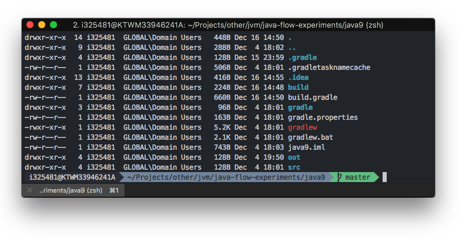

dotfiles
========
my dotfiles for Linux and macOS

installation
------------

```shell
git clone git@github.com:pwittchen/dotfiles.git
cd dotfiles && ./install.sh
```

**note**: commands above won't install plugin managers & plugins

update
------

```shell
cd dotfiles
git pull && ./install.sh
```

plugins
-------
- **tmux**
  - plugin manager: [tpm](https://github.com/tmux-plugins/tpm)
  - plugins:
    - [tmux-sidebar](https://github.com/tmux-plugins/tmux-sidebar)
    - [tmux-copycat](https://github.com/tmux-plugins/tmux-copycat)
    - [tmux-pain-control](https://github.com/tmux-plugins/tmux-pain-control)
    - [tmux-urlview](https://github.com/tmux-plugins/tmux-urlview)
    - [tmux-plugin-battery](https://github.com/pwittchen/tmux-plugin-battery)
    - [tmux-plugin-uptime](https://github.com/pwittchen/tmux-plugin-uptime)
    - [tmux-plugin-cpu](https://github.com/pwittchen/tmux-plugin-cpu)
    - [tmux-plugin-ram](https://github.com/pwittchen/tmux-plugin-ram)
    - [tmux-plugin-ip](https://github.com/pwittchen/tmux-plugin-ip)
    - [tmux-plugin-spotify](https://github.com/pwittchen/tmux-plugin-spotify)
- **vim**
  - plugin manager: [vim-pathogen](https://github.com/tpope/vim-pathogen)
  - plugins:
    - [nerdtree](https://github.com/scrooloose/nerdtree)
    - [tagbar](https://github.com/majutsushi/tagbar)
    - [ctrlp](https://github.com/kien/ctrlp.vim)
    
themes and terminal emulators
-----------------------------

[Themes](https://github.com/robbyrussell/oh-my-zsh/wiki/themes) I usually use for oh-my-zsh are:
- [minimal](https://github.com/robbyrussell/oh-my-zsh/wiki/themes#minimal)
- [agnoster](https://github.com/robbyrussell/oh-my-zsh/wiki/themes#agnoster)
  - color schemes usually used for macOS & Linux: Solarized Dark, Neutron, Monokai Dark or similar
  - font for macOS: `12 pt Meslo LG M DZ Regular for Powerline` can be found in [powerline/fonts](https://github.com/powerline/fonts) repository
  - font for Linux: [Menlo for PowerLine](https://github.com/abertsch/Menlo-for-Powerline)

Terminal emulators I use:
- [Tilix](https://gnunn1.github.io/tilix-web/) on Linux
   - custom color scheme: [color_scheme_linux_tilix.json](https://github.com/pwittchen/dotfiles/blob/master/color_scheme_linux_tilix.json) based on Monokai Dark
   - more color schemes for Tilix on Linux: https://github.com/storm119/Tilix-Themes
 - [iTerm2](https://www.iterm2.com/) on macOS
   - custom color scheme: [color_scheme_macos_iterm2.itermcolors](https://github.com/pwittchen/dotfiles/blob/master/color_scheme_macos_iterm2.itermcolors) based on Neutron
   - more color schemes for iTerm2 on macOS: https://github.com/mbadolato/iTerm2-Color-Schemes

screenshots
-----------

### macOS


